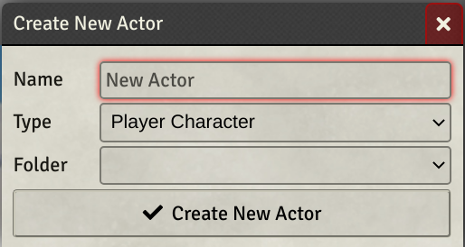

Autofocus Name Prompts is a tiny module that autofocuses the cursor in the name field when you create an entity, like a new journal entry, item, actor, etc.

That's it. Enjoy :)

Manifest:  
https://github.com/ofdiceandmagic/fvtt-autofocus-name-prompts/releases/latest/download/module.json
